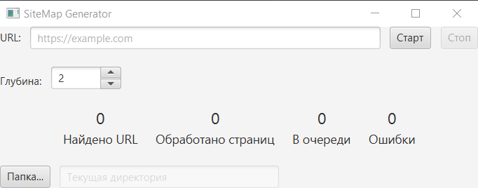

# Sitemap-Generator
Графическое приложение для генерации XML-карт сайта (sitemap) с использованием JavaFX



## Основные возможности

- Автоматический обход веб-сайта с настраиваемой глубиной
- Статистика в реальном времени:
    - Найдено URL
    - Обработано страниц
    - Страниц в очереди
    - Количество ошибок
- Динамический расчет приоритета страниц (priority)
- Выбор папки для сохранения sitemap.xml

## Технологии

- **JavaFX** - графический интерфейс
- **ForkJoinPool** - многопоточный обход страниц
- **Jsoup** - парсинг HTML и анализ ссылок
- **Concurrent Collections** - потокобезопасные структуры данных
- **Maven** - сборка проекта

## Запуск приложения

1. Клонировать репозиторий:
```bash
git clone https://github.com/l-salaga-l/Sitemap-Generator.git
```

2. Собрать и запустить:

```bash
mvn clean javafx:run
```


## Основные возможности

- Автоматический обход веб-сайта с настраиваемой глубиной
- Статистика в реальном времени:
    - Найдено URL
    - Обработано страниц
    - Страниц в очереди
    - Количество ошибок
- Динамический расчет приоритета страниц (priority)
- Выбор папки для сохранения sitemap.xml

## Технологии

- **JavaFX** - графический интерфейс
- **ForkJoinPool** - многопоточный обход страниц
- **Jsoup** - парсинг HTML и анализ ссылок
- **Concurrent Collections** - потокобезопасные структуры данных
- **Maven** - сборка проекта

## Запуск приложения

1. Клонировать репозиторий:
```bash
git clone https://github.com/l-salaga-l/Sitemap-Generator.git
```

2. Собрать и запустить:

```bash
mvn clean javafx:run
```